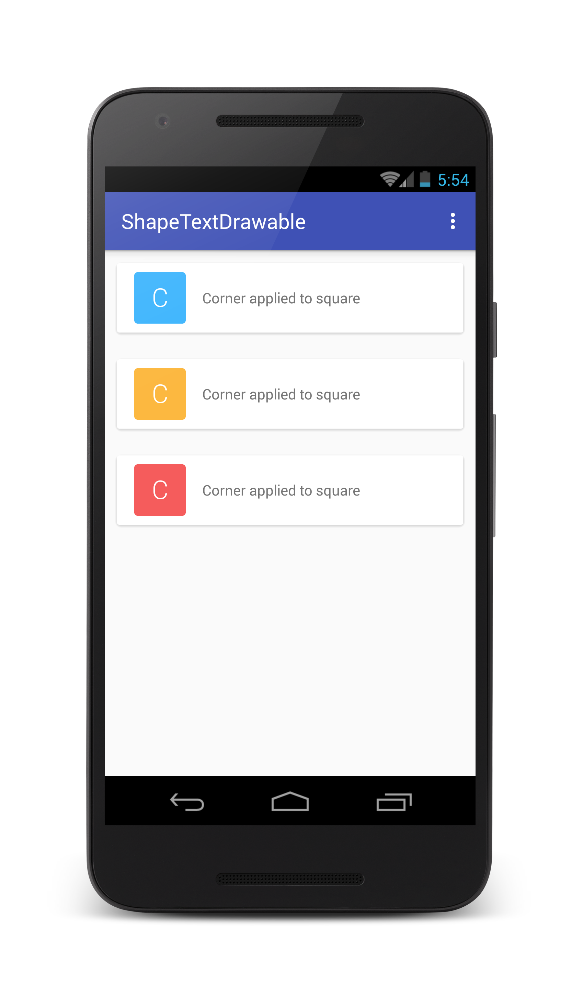
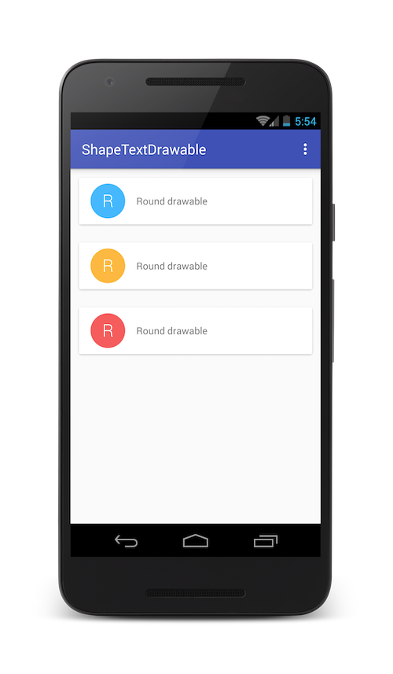

# ShapeTextDrawable
A Kotlin lightweight library to easily draw shapes that may contain text within them

Square shape | Round Square shape | Round shape
---- | ---- | ----
 |  | 

## Download

Gradle:

```groovy
compile 'com.github.stephenvinouze:shapetextdrawable:1.0.0'
```

Maven:

```xml
<dependency>
  <groupId>com.github.stephenvinouze</groupId>
  <artifactId>shapetextdrawable</artifactId>
  <version>1.0.0</version>
  <type>aar</type>
</dependency>
```

Eclipse: [shapetextdrawable-1.0.0.aar](https://github.com/StephenVinouze/ShapeTextDrawable/releases/download/1.0.0/shapetextdrawable-1.0.0.aar)

## Usage
